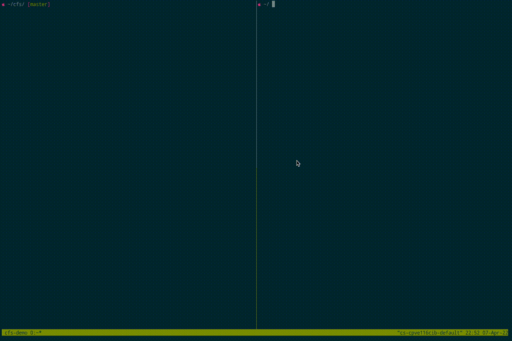

# CFS
CFS stands for Content addressable filesystem. It is built to serve files from Content Addressable Storage (CAS) to application as a [FUSE filesystem](https://en.wikipedia.org/wiki/Filesystem_in_Userspace).

# Why do we need a filesystem for CAS?
* CAS supports storing files and directories natively, but there is no easy way to navitage through the file content and especially the directory tree content. A filesystem allows user to easily access those data through a Linux filesystem interface with a set of common tools, eg `ls`, `cat`, `grep`, etc.
* Data transfer from CI to GCS and to Hydra has been a common pattern. The redundant transfers not only incurs storage cost but also data transfer cost, not to mention in a across cloud environment. With a FUSE filesystem, it enables the possiblity to short cut the data tranfers, and eliminiate the extra storage cost by reading data directly from CI to Hydra or other compuate environment, eg. Kubernetes.
* Filesystem enables on demand loading of the data that the aplication actually needs. Application only need to read the data when it needs it, instead of downloading the whole directory tree up front but only reads a small portons of it.

# CFS Daemon
CFS daemon is the implementation of FUSE api for CAS contents.



# casctl
Along with the CFS daemon, there is a companinon tool that used to inspect CAS and debug the daemon.

```sh
> cargo run --bin casctl -- --help 

casctl
A CAS CLI

USAGE:
    casctl <SUBCOMMAND>

OPTIONS:
    -h, --help    Print help information

SUBCOMMANDS:
    download    Download file or directory from CAS
    help        Print this message or the help of the given subcommand(s)
    test
    upload      Upload file or directory to CAS
```

## Upload
Use the `casctl upload` subcommand to upload a file or directory to CAS.

```sh
casctl-upload
Upload file or directory to CAS

USAGE:
    casctl upload [OPTIONS] <PATH>

ARGS:
    <PATH>    The path to the file or directory to be uploaded

OPTIONS:
        --dry-run      Generate the root digest without the actual upload
    -h, --help         Print help information
    -o, --out <OUT>    The optional output path to write the root digest
```

## Download
Use the `casctl download` subcommand to download a file from CAS.

```sh
casctl-download
Download file or directory from CAS

USAGE:
    casctl download <PATH> <DIGEST>

ARGS:
    <PATH>      The path to the file or directory to be downloaded
    <DIGEST>    The digest of the content

OPTIONS:
    -h, --help    Print help information
```

# Develop
## Tools and installation
* Rust: We use Rust to build this project. Install Rust through [Rust installation guide](https://www.rust-lang.org/tools/install). Minimum required Rust version: 1.57.0 
* [cargo-edit](https://github.com/killercup/cargo-edit): used for editing dependencies.

## Build
```sh
# To build a dev version
cargo build

# To build a release version
cargo build --release
```

## Run the daemon
```sh

# Uncomment the user_allow_other
sudo sed -i '/user_allow_other/s/^#//g'  /etc/fuse.conf

# Run the daemon
cargo run --bin cfsd -- --auto_unmount "3acb2d7041125c7617543a9dfd8d19d5b8c9e03ad2a5675ceb56cca78454480e/165" /tmp/cfs-dir

# View the files
ls -al /tmp/cfs-dir
```
